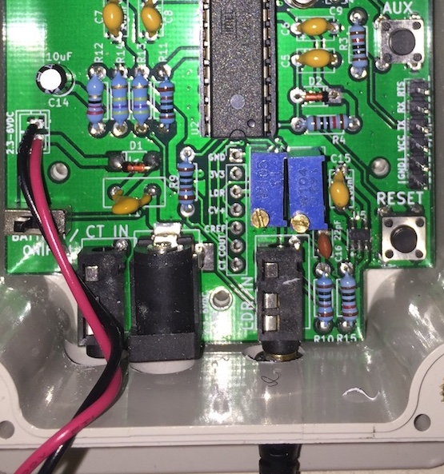

# Meterman MeterNode

This repo contains PCB designs and firmware for a low-cost, low-power, wireless LED pulse meter node.  It was designed to read and transmit energy consumption from an electricity smart meter LED pulses, but could be used for other LED pulse counting applications.  


This 'MeterNode' is part of a basic electricity monitoring system described at http://leehonan.com/meterman.  The 'MeterMan' system consists of:

* One or more MeterNodes, transmitting energy consumption at set intervals using sub-GHz packet radio (RFM69 @ 434/868/915MHz).

* A [Gateway](https://github.com/leehonan/rfm69-pi-gateway), being a Raspberry Pi 'Hat' that bridges the RFM69 network to a Raspberry Pi's UART Serial interface.

* A [Server](https://github.com/leehonan/meterman-server) that runs on the Pi, maintains energy consumption data, and provides access to this and other operational data through an API, a file journal, and a realtime socket API (socket API is TBD).

## This Repo

This (MeterNode) repo consists of:

* The MeterNode PCB design (authored in KiCad).  This mounts in a small box and is powered by 3xAA Batteries or a DC adapter.  It attaches to a small 'puck' sensor using a 3.5mm audio cable.

* The MeterNode Puck PCB design (also KiCad).

* 3D shape files (.STL) for the puck housing.

* Source code for the MeterNode firmware (AVR C with Arduino extensions).  

All contents are licenced according to the MIT licence.

## MeterNode Overview
The image below shows a partially-populated MeterNode installed in a project box with a 3xAA battery holder (empty space at bottom left due to omitting CT and DC power sub-circuits).


The MeterNode's companion 'Puck' is a peripheral pulse sensor (not really in the shape of a puck - although that was the original idea).  It has a photoresistor on one side, and a red 'super bright' LED on the other.  The photoresistor is placed over the smart meter's 'consumption' LED, and connected to the monitoring MeterNode using a TRS or TRRS 3.5mm cable (with a 3.5mm TRRS jack on each PCB).  

<table><tr>
<td align="center">

</td>
<td align="center">

</td>
</tr></table>

The smart meter's consumption LED will pulse on/off as a particular unit of power is consumed (e.g. 1 pulse per watt-hour/Wh) - this varies by meter and is configurable on the MeterNode.  The puck's red LED can flash in unison with the smart meter (off by default to conserve battery).

While there are a number of ways to interrogate a smart meter (e.g. ZigBee, Serial and Optical ports), the approach used is cheap, non-invasive, hacker-friendly, and 'permissionless'.  Zigbee is not cheap, not hacker-friendly, and requires multiple permissions (including a Zigbee production cert and utility device authorisation).  Optical ports vary by meter and are usually password-protected.  Many meters do not have serial ports.

Later iterations may include direct wired metering ('behind' the smart meter) and additional CT clamps.

The MeterNode itself comprises:
* A DC power sub-circuit, switchable between battery/DC jack (3VDC to 5VDC) and FTDI (or off if no FTDI connection).  Uses a MCP1700 regulator to supply 3.3VDC.  Includes an upstream voltage divider for reading VIN or battery voltage (giving an indication of the battery's remaining charge).

* An ATMega 328P MCU sub-circuit, along the lines of common 'minimal low-power Arduino' circuits.  FTDI Header for programming and control.

* A PCF2123 low-power RTC.

* A radio sub-circuit with an RFM69W module.  The design uses an RP-SMA connector, but the PCB also supports uFL or a wire antenna.

* A sub-circuit to integrate the Puck, with a nano-comparator to give a definitive low/high signal to the MCU.  Because this is a slow-moving signal a Schmitt Trigger is used to avoid oscillation (through hysteresis).

* A sub-circuit to integrate a CT clamp, as used by [OpenEnergyMonitor's emonTX](https://github.com/openenergymonitor/emontx3).  This may be left unpopulated and is probably not practical to use if mounting next to a smart meter which tends to be outside and some distance from the distribution board/panel, which is typically indoors (unless running a long cable to the Puck).

The following images show a fully-populated MeterNode, with a DC jack and CT Clamp, alongside a partially-populated MeterNode with neither.

<table><tr>
<td align="center">

</td>
<td align="center">

</td>
</tr></table>

## Operation

The MeterNode 'sleeps' in normal operation (consuming about 80uA/microamps), with the MCU waking on an interrupt to record each meter LED pulse and send/receive messages as dictated by configurable timers.  

Given that it wakes/sleeps sporadically, the MeterNode initiates all two-way communication with the Gateway.  Configuration/control instructions to the MeterNode are effectively queued at the Gateway and despatched to the MeterNode when it requests 'Gateway Instructions' (GINR message).  While these instructions are usually polled for at a 'lazy' rate (e.g. every ten minutes), an aggressive polling instruction (GITR message) can be sent to cause the MeterNode to temporarily poll more frequently (e.g. every 30s for 5 min).

The Meternode's operation follows a loop:

* Wake up when an interrupt is triggered by an LED pulse. (At boot the Meternode will stay awake for 15s).

* Log the LED pulse with a timestamp from the onboard RTC, flashing the puck LED if configured.

* Check whether the current metering interval has expired (e.g. 30s), and if so, close it and begin a new one in the metering ring buffer (with a current reading from the CT clamp if configured).  Also check whether a 'meter update' message needs to be sent to the gateway.

* Check whether timers have expired for other periodic tasks, such as synchronising the RTC, adjusting Radio TX Power to fit target RSSI, or getting Gateway Instructions.  

* If required, check for an instruction from the gateway (passing status info such as battery voltage in the request) and process it.

* Sleep until the next LED pulse.

### Metering Approach & Limitations

The MeterNode simply counts consumption LED pulses, and records these against interval entries, with timing according to its onboard clock (RTC).  The pickup/counting is 100% accurate if the sensor is setup properly and not subject to extreme light interference.  A cumulative value is stored and transmitted, allowing for interval update message failures.

The MeterNode can be set to a notional 'base value' to track the smart meter being monitored.  This allows for easy verification that the MeterNode is tracking accurately, although it is difficult to align the two exactly as the smart meter will only display a coarse value (e.g. to the nearest 100 Wh).  This can be set using a serial command or radio message as described below.

In normal operation, the MeterNode will create/close interval entries every n seconds, and despatch these in 'meter update' messages to provide energy consumption snapshots.

In the unlikely case that the smart meter is dormant (i.e. 0Wh consumption), the MeterNode will sleep ad infinitum, but then wake and send an update message that may have skipped previous intervals.

The MeterNode will execute a 'rebase' any time its clock changes, or the meter's base value is reset.  This results in a 'rebase message' which instructs consumers that the time/energy basis of the accumulation meter has changed.  Rebases will occur when:

* The MeterNode is booted.

* The RTC is set.

* The base value of the accumulation meter is changed.

* The accumulation meter cycles from its maximum value (4.2 GWh) to 0 Wh.

The MeterNode cannot:
* Guarantee a message for every 0Wh consumption interval, or indeed guarantee that any message will be sent/received successfully.

* Guarantee a rebase message will be received.  Consuming applications should alert on large increases or reversals in time/meter values.

* Maintain meter readings between reboots.

* Check itself against the meter being tracked.

* Confirm that it is alive, or detect issues with its sensor (as it will be asleep) - although this can be done at the consuming node(s).

### MeterNode Hardware Interface
The MeterNode PCB has the following switches, buttons, headers, and adjustable components.  These are shown below.
<table><tr>
<td align="center">

</td>
<td align="center">

</td>
</tr></table>

* A VIN switch that toggles between either battery/DC-in or FTDI/Off.  A battery must not be connected at the same time as a DC adapter, but either can be connected at the same time as a FTDI adapter.  If the switch is in the FTDI/Off position but FTDI is not connected the device will be off.  Conversely if the switch is in the battery/DC-in position but a FTDI adapter is connected, power will be drawn from the battery/DC adapter (with other FTDI functions working as normal).

* A MCU Reset button that reboots the MCU.

* An auxiliary button that is used to either toggle sleep mode or enable a temporary alignment mode:

    - If sleeping, any detected press will set sleep off (3 flashes).
    Release as soon as flashing starts.  Will need to hold down until
    interrupt fires (i.e. watched LED pulses).

    - If not sleeping, short press of < 1s will set sleep on (5 flashes).
    Release as soon as flashing starts.

    - If not sleeping, long press of > 3s will start a 60s adjustment mode (7
    flashes) that forces meter LED rate to 1, and time to 0 (mimic watched
    LED).  This will cause the Puck LED to flash in unison with the smart meter's LED for 60s.

* An FTDI header for use with a USB-FTDI adapter.  This is used to upload firmware and also to interact with the MCU directly over a serial connection (viewing events and using the MeterNode's command protocol to view information and change settings).  Firmware can be uploaded using avrdude directly, or via an IDE (such as platform.io).  Depending on the adapter and client software uses, this may reset the MCU.

* A breakout header that is used for setup and diagnosis, typically with a multimeter.  The positions are described below and pictured earlier:


| Position | Description |
| :--- |:---|
| GND | DC Ground. |
| 3V3   | 3.3VDC from regulator.  |
| LDR  | Output from LDR, fed to Comparator via Schmitt Trigger (from which it is segregated by a 1K resistor). <br> Tuned using the LDR trimpot, typically 0.2V to 2.0V (LED on-off). |
| CV+  | V+ input to Comparator, affected by Schmitt trigger feedback. |
| CREF  | LDR Comparator Reference Voltage (ideally 1.5V).  Set using the REF trimpot. |
| COUT | Output from Comparator.  Should be Low (0V) or High(3.3V).  Goes to MCU D3 (interrupt 1). |   
| CT | Output from CT clamp circuit.  Value from 0V to 3.3V is linear representation of RMS current.  Goes to MCU A1.  |


### Puck Setup
The setup and calibration of the light-dependent resistor (LDR) is critical.  It should be positioned directly over the LED being monitored, and shielded from ambient light.  It is best installed using double-sided tape to affix the base of the housing to the smart meter, ensuring that the LED is centred in the base's hole (that the photoresistor 'looks through').  See the assembly instructions below for more detail.

While the approach used is not overly sensitive to ambient light (compared with photodiodes, or an LDR without a comparator and schmitt trigger), minimising ambient light will increase the range around the comparator's reference/trigger point.  In practice the design used can work with some intrusion of relatively bright light (e.g. direct sunlight on a meter), but only up to a point.

With the MeterNode on and the puck installed, connected:
* Connect a multimeter to GND/CREF.  Adjust to 1.5V using the REF trimpot.

* Move the positive probe to the LDR breakout header position.  Adjust the LDR trimpot until you see a substantial swing between low and high states (e.g. 0.2V to 2.0V) around CREF.  A high level of ambient light may boost the lower value.  The trimpot's effective zone if fairly small - it will appear to be stuck high or low for many turns, and then suddenly become responsive.

* Move the positive probe to the COUT breakout header position.  This should be swinging between 0V (low) and 3.3V (high) to indicate reads.

Given that the actual hystersis gap of the comparator circuit is ~10mV, in theory a small swing either side of CREF will be sufficient to produce a definite high/low reading.  However, using a very wide value will compensate for fluctuations in ambient light and other factors.

### CT Clamp Setup
TODO

### Uploading Firmware
Firmware is uploaded using avrdude (alternately through an IDE such as atom/platform.io, the Arduino IDE may work too).  For an FTDI adapter with Id A403JXEV on OSX or Linux the command will be something like:

```
sudo avrdude -c arduino -p atmega328p -P /dev/cu.usbserial-A403JXEV -b 115200 -U flash:w:/home/tmp/firmware.hex
```

### Serial Communication & Console
A serial connection can be made using a baud of 115200bps, 8N1 (8 data bits, no parity bit, 1 stop bit).  

The following commands are available through the serial console (case-insensitive):

| Command | Description |
| :--- |:---|
| help | Prints a list of commands. |
| z  | Toggles sleep on and off. |
| dump  | Prints (dumps) MeterNode config and status to the console.  |
| rcfg | Reset Config.  Resets configuration values stored in EEPROM to defaults and re-applies these.  |
| time | Prints current time from RTC. Set using time=[seconds since UNIX epoch, UTC] |
| logl | Prints log level - ERROR, WARN, INFO, DEBUG.  Set with logl=[log level]|
| ekey | Prints encryption key (16 byte AES) used by network participants for radio comms.  Set with ekey=[encryption key], e.g. ekey=CHANGE_THIS_ASAP|
| neti | Prints MeterNode's Network Id comprised of octets akin to an IP address but with an extra subnet (as the 4 octets define a subnet, with node addressing within this).  Set with neti=[network_id].  At least two octets need to be non-zero so 0.0.1.1 is the 'lowest' usable network subnet.  E.g. neti=0.0.1.1|
| gwid | Prints the 'node id' for the gateway.  This should be 1 by convention, but can be any unallocated address from 1 to 253. Set with gwid=[gateway Id]|
| noid | Print/set MeterNode's node id (set with noid=[node id]).  2-253 by convention. |
| trss | Print/set target RSSI for auto-tuning (set with TRSS=[target RSSI]).  Range is -100 (no signal) to 1 (almost no noise), 0 is disable auto-tuning. -75 is a reasonable value. |
| txpw | Print/set transmission power (set with TXPW=[tx power in dBi]).  For RFM69W range is -18 to +13, for RFM69HW is -14 to +20. Higher values will use more power. |
| mtrv | Set meter value (set with MTRV=[meter value]) in Wh.  May be used to track electricity meter's register. Will overflow and cycle to 0 at 4.2 billion Wh. |
| mtrr |  Print/set meter impulse per kWh rate (set with MTRR=[impulse count]).  E.g. mtrr=1000. |
| mtri |  Print/set meter interval (set with MTRI=[meter interval in sec]).  Up to 255. |
| test |  Toggle test mode, forcing sleep off and simulating watched meter LED pulses. |
| ledr |  Print/set puck LED rate (set with LEDR=[rate per meter LED]).  This is the number of 'watched meter' LED flash/pulses per 'puck' LED flash in response.  E.g. could flash once every 10 to consume battery.  0 means LED is disabled (except to indicate boot). |
| ledt |  Print/set puck LED time (set with LEDT=[time in millis]).  Is max duration of each LED pulse emitted by the puck in millis. Setting to 0 will cause to flash in unison with meter.  Maximum of 3000, but puck LED will always go low/off on falling edge of meter's pulse. |


### Radio Protocol
The MeterNode uses the the [RadioHead Library](http://www.airspayce.com/mikem/arduino/RadioHead/), and 'Reliable Datagrams' for all messaging.

Messages are AES-128 encrypted, with a maximum payload of 61 bytes.  Fields are comma-delimited, records semi-colon-delimited (only used for meter updates).

In addition to being encrypted, messages are contained within the 'subnet' created by the Network Id setting (e.g. 0.0.1.1), with each node having an identifier between 1 and 254 (255 is broadcast).  By convention I use 1 for a gateway, with nodes beginning at 2 (e.g. 0.0.1.1.2).

All datetimes are seconds since UNIX epoch (01/01/1970 00:00:00 UTC).

| Message | From | To | Description|
| :--- |:---| :--- |:---|
| Meter Update - with Current | node | gateway | Communicates the _n_ most recent closed meter intervals to the Gateway, with the meter's previous accumulated value (e.g. 100,000Wh), consumption in each interval (e.g. 15Wh), and an 'on the spot' current measurement taken at the end of the interval. <br> Format: `MUPC,<last_entry_finish_time>,<last_entry_meter_value>,{2..n of <interval_duration>,<interval_value>,<spot_rms_current>}` <br> Where in this case meter and interval values are in Wh (configurable) - with last entry value being a baseline accumulation entry (the last entry broadcast by the MeterNode) and interval values being increments to that, interval duration in seconds, current in Amps. <br> E.g.: `MUPC,1496842913428,18829393;15,1,10.2;15,5,10.7`  <br> Due to message size constraints this will contain no more than 2 interval entries.|
| Meter Update - no Current | node | gateway | As above, but without current measurements. <br> Format: `MUP_,<last_entry_finish_time>,<last_entry_meter_value>,{2..n of <interval_duration>,<interval_value>}` <br> E.g.: `MUP_,1496842913428,18829393;15,1;15,5;15,2;16,3` <br> The number of interval entries in each message can be set by a firmware constant, with 3 or 4 being a reasonable value.|
| Meter Rebase  | node  | gateway  | Sent at boot or whenever meter value or RTC adjusted to notify the gateway of step-changes in time or meter value.  'Re-baselines' the meter, such that all prior messages should be regarded as nominal/unreliable for determining an accumulation value.    <br>Format: `MREB,<meter_time_start>,<meter_value_start>` <br> E.g.: `MREB,1496842913428,18829393`|
| Gateway Instruction Request  | node  | gateway  | Instruction Request to Gateway, including node status data. <br>Format: `GINR,<battery_voltage>,<uptime_secs>,<sleeptime_secs>,<free_ram>,<last_rssi>,<puck_led_rate>,<puck_led_time>,<meter_interval_time>,<meter_imp_per_kwh>`<br>E.g.:`GINR,4300,890000,555000,880,-80,10,100,5,1000` |
| Meter Instruction - Set Interval  | gateway  | node | Set accumulation meter interval. Note all such messages from the Gateway inform the node of the last RSSI for that node at the gateway (for use in TX Power auto-tuning).  <br>Format: `MINI,<new_interval>,<last_node_rssi>`<br>E.g.:`MINI,5,-70`  |
| Meter Instruction - Set Temporary Polling  | gateway  | node | Request from Gateway to temporarily increase GINR polling rate for a specified duration (secs). <br>Format: `GITR,<new_rate>,<duration>,<last_node_rssi>`<br>E.g.:`GITR,30,600,-70` |
| Meter Instruction - Set Value  | gateway  | node | Set accumulation meter value. <br>Format: `MVAI,<new_meter_value>,<last_node_rssi>`<br>E.g.:`MVAI,120000,-70`  |
| Meter Instruction - Set Puck LED  | gateway  | node | Set Puck LED pulse rate and duration. <br>Format: `MPLI,<led_pulse_rate>,<led_pulse_duration>,<last_node_rssi>`<br>E.g.:`MPLI,1,500,-70`  |
| Meter Instruction - 'No Op'  | gateway  | node | 'No op' ACK to GINR, provides RSSI for auto-tuning. <br>Format: `MNOI,<last_node_rssi>`<br>E.g.:`MNOI,-70`  |
| Clock Sync Request | node | gateway  | Clock Sync Ping Request to Gateway. <br>Format: `GMSG,<message>`<br>E.g.:`GMSG,BOOT v2. Flags: EX` |
| Clock Sync Response | gateway  | node | Clock Sync Ping Response from Gateway, used to sync local RTC. <br>Format: `PRSP,<request_time_node>,<current_time_gateway>,<align>,<last_node_rssi>`<br>E.g.:`PRSP;14968429155328,1496842915428,1,-70` |
| General-Purpose Message  | any  | any  | Broadcast to all devices in network.  Used to communicate boot event. <br>Format: `GMSG,<message>`<br>E.g.:`GMSG,BOOT v2. Flags: EX`|


**Interpreting Meter Updates**

The Meter Update Message should be interpreted as follows:
* Times are **inclusive**.  So consumption of 10Wh per 30s interval over 2 minutes from 10AM would be treated as:
    ```
    10:00:00 - 10:00:29 = 10Wh
    10:00:30 - 10:00:59 = 10Wh
    10:01:00 - 10:01:29 = 10Wh
    10:01:30 - 10:01:59 = 10Wh
    ```     

* last_entry_finish_time and last_entry_meter_value is for the last entry in the last MUP communicated by the meter node.  So for the example above, at 10:00:00 the interval entry ending at 09:59:59 was closed, and sent in a MUP with the 3 entries that preceded it.  At 10:00:00, 09:59:59 has just expired with an accumulated meter value of 5622Wh - these will form the baseline for the next MUP.

* Given this example, the next MUP is sent at 10:02:00 will be as follows:

    ```
    MUP_,1511737199,5622;30,10;30,10;30,10;30,10;
    ```

* Of course a MUP could be missed (without a rebase).  The consumer should take account of the baseline value, and not merely store/process the interval entries.    

### Power consumption & battery life
When awake the MCU consumes about 7mA/milliamps, and depending on radio config about 30-50mA for a few milliseconds when transmitting messages.  

In typical use, the MeterNode spends >=99% of its time asleep (affected by meter entry interval lengths).  

3xAA batteries should last 6-12 months with infrequent communication (TBC), although theoretically would last several years if sleeping perpetually, about 1-2 weeks if never sleeping.  A conservative meter interval (e.g. 60s), with 4 entries per message, and a long GINR polling interval (e.g. 600s) is recommended.

The MeterNode will function while battery voltage is >= 2.8V (or 2800mV as reported in GINR messages) - with the 328P MCU being the limiting factor, ideally supplied >=3.3V.  Unfortunately the regulator used (MCP1700) is only a step-down regulator - it cannot step-up lower voltages.  It is otherwise an excellent choice for this application.  Consuming applications should set a battery replacement alert threshold, e.g. 3.0V.

Using the puck LED (which consumes about 1mA) to indicate a meter LED flash will reduce battery life significantly - this should be minimised to testing, e.g. to check alignment (which can be performed more accurately with a multimeter).

## Implementation - MeterNode Firmware
For simplicity, the firmware is implemented as a single C++ program (no header file), although it will need supporting libraries to compile.  There is some redundancy versus the companion gateway firmware - the common components may be moved to a library.  Some Arduino library features are used.

The firmware requires a 328P that has been flashed with Optiboot.  It uses about 98% of
available program memory with CT_ENABLED=true (which will cause the compiler to include code for the CT clamp).  Depending on configuration, about 500 bytes RAM will remain free at runtime (of 2K).  

There are a number of configuration settings at the beginning of the source code.  Particular attention should be paid to the 'Main Config Parameters'.

Note that a version is set in the firmware, and broadcast on boot.

The code is fairly well-documented so isn't covered further here.

## Implementation - PCBs & Cases

The MeterNode PCB measures 60x92mm and is designed to fit a widely-available [100x68x50mm 'project box'](https://www.banggood.com/White-Plastic-Waterproof-Electronic-Case-PCB-Box-100x68x50mm-p-948109.html), shown below.


The MeterNode's companion Puck PCB measures 15x20mm and can be mounted in a 3D-printed case (also in this repo).  The puck can be easily aligned with the meter's consumption LED by adhering the base/case only (positioning its hole directly over the LED) before completing the assembly.


The images below show regular pucks both assembled and disassembled, along with an alternate puck configuration, where the black 'collet' piece shown (.STL included) can be used to position the LDR sensor in tight positions.  The protruding arm is used to adhere the sensor (e.g. using double-sided tape).  The particular meter that necessitated this was the iCredit 500 which has its LED tucked into a tight corner.

<table><tr>
<td align="center">

</td>
<td align="center">

</td>
</tr></table>

The Puck Schematic & PCB is straightforward, so isn't discussed further here - except to mention that care should be taken when soldering as its small size means it can heat up quickly.  

### MeterNode Schematic & PCB


The PCB design minimises the use of SMT components, and uses through-hole instead.  When I originally designed the board I wanted to make it 'hobbyist-friendly' with the only SMT component being the easily-solderable RFM69 and RP-SMA connector.  However in subsequent iterations I added the RTC and comparator, where the best choices were SMT.  This makes the board a hodge-podge, and annoying to make in volume (as I have had to for a few experiments). I may do an SMT-only variant in the future.

Highlights:
* The choice of a photoresistor (LDR) was made after a lot of research and experimentation.  Other projects have concluded that LDRs are too slow, or too affected by ambient light.  I found them to be better in terms of power consumption than alternatives such as photodiodes (about 1/10th), while offering a wide pickup range, and responding 'fast enough' (up to 10Hz).

* A TRRS jack is used for the puck and CT as I had a few hundred of these on-hand.  TRRS cables are unnecessary, TRS can be used.  R1 is not connected on the LDR jack, and R1 and R2 are not connected on the CT jack.
These could be hacked for another application.

* The MCP1700 regulator (3.3V) was chosen due to its low quiescent consumption (1.6uA).  I used a regulator because while the 328P and RTC tolerate VIN ~5.5VDC, the RFM69 has a maximum VIN of only 3.6VDC.  

* A voltage divider (consuming about 1.7uA) is used to measure the voltage input to the regulator - chiefly to allow a basic 'battery meter'.

* Any RFM69W or RFM69HW module will work.  I use the RFM69W because it can be tuned to use less TX power than the RFM69HW.  Given that there is no advantage to mixing radios, I use the RFM69HW on gateways because they are cheaper.

* The RTC used (PCF2123) has low quiescent power consumption (as low as 100nA) and is economical.  It needs a 32.768kHz crystal (7pF, +/- 20 ppm).

* The comparator used (TS881) has low quiescent power consumption (as low as 210nA), is simple to use, and is economical.

* The PCB design also contains a basic AC current sensing circuit for use with an optional CT clamp (around an active or neutral wire).  I used the design from [OpenEnergyMonitor](https://learn.openenergymonitor.org/electricity-monitoring/ct-sensors/how-to-build-an-arduino-energy-monitor-measuring-current-only).  This was a late addition to the design as I wanted to avoid looking at their well-established EmonTx project and see how I went my 'rolling my own'.  When I saw how easy the CT was too add I couldn't resist.  Of course, it will often be impractical to install alongside a smart meter unless running a long cable to the puck (as noted above).
